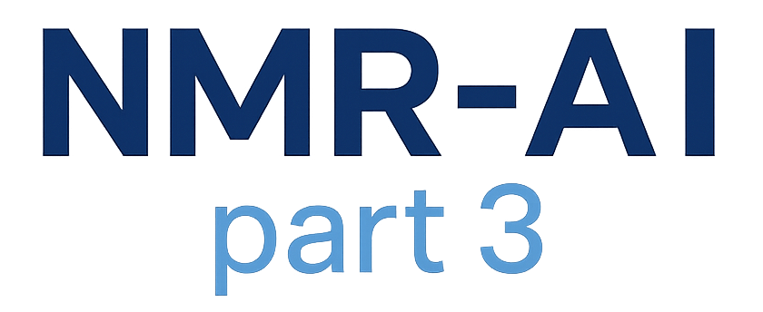

<p align="center">
  
</p>

# NMR-AI_part3: Input Data & Scripts

This repository contains the datasets and source code used in the third publication of the *From NMR to AI* series:  
**[Title Placeholder]**, *[DOI Placeholder]*.

All scripts are fully integrated with **[MLflow](https://mlflow.org/)** for experiment tracking and **[Optuna](https://optuna.org/)** for hyperparameter optimization.  
They support reproducible experiments, model comparison, and artifact logging across all stages of training and evaluation.

> ⚠️ **Hardware Requirements:**  
> - The machine learning scripts (SVR and XGBoost) require a CUDA-enabled NVIDIA GPU for execution.  
> - Neural network scripts (CNNs, MLPs) can run on CPU, but training will be significantly slower.

The work focuses on the prediction of CHI logD values using classical machine learning algorithms and neural network architectures trained on NMR spectral representations (¹H, ¹³C, and hybrid).

All scripts follow the PEP8 standard and support Python 3.12.

---

## Repository Structure

```
NMR-AI_part3/
├── 01_datasets/
├── 02_machine_learning_scripts/
│   ├── SVR_optuna_workflow/
│   └── XGB_optuna_workflow/
├── 03_neural_networks_scripts/
├── 04_hybrid_neural_networks_scripts/
├── 05_conda_environments/
├── 06_utility_scripts/
├── 07_williams_plots/
└── 08_SHAP/
```

---

## 01_datasets/

Contains all CSV input files used for training and testing. Each file follows the schema:

- `MOLECULE_NAME`  
- `LABEL` (target CHI logD value)  
- `FEATURE_001` … `FEATURE_NNN` (spectral or fingerprint features)

Datasets include both newly generated data and updated versions of previously published sets.

---

## 02_machine_learning_scripts/

### ➤ SVR_optuna_workflow/

Classical regression pipeline based on **Support Vector Regression (SVR)**:

- `SVR_main.py` – master script executing the full pipeline (Optuna + evaluation)
- `SVR_module1.py` – performs Optuna-based hyperparameter tuning
- `SVR_module2.py` – evaluates the best model using 10-fold cross-validation

Usage:
```bash
python SVR_main.py <input_directory> --experiment_name <mlflow_experiment_name>
```

### ➤ XGB_optuna_workflow/

Same workflow for **XGBoost regression**:

- `XGB_main.py`, `XGB_module1.py`, `XGB_module2.py` – analogous to SVR

Usage:
```bash
python XGB_main.py <input_directory> --experiment_name <mlflow_experiment_name>
```

---

## 03_neural_networks_scripts/

Scripts for **1D neural network models** working on either ¹H or ¹³C spectral data:

- `CNN_1D_pytorch.py` – 1D convolutional network with Optuna tuning and 10CV evaluation
- `MLP_1D_pytorch.py` – fully connected MLP for 1D spectral input
- `tags_config_CNN_1D.py`, `tags_config_MLP_1D.py` – MLflow tag dictionaries (user-defined)

Usage:
```bash
python CNN_1D_pytorch.py --input_csv <file> --experiment_name <mlflow_name>
python MLP_1D_pytorch.py --input_csv <file> --experiment_name <mlflow_name>
```

---

## 04_hybrid_neural_networks_scripts/

Advanced architectures combining **¹H and ¹³C** representations in dual-stream networks:

- `cnn_2d_stacked_1H_13C.py` – 2D CNN on stacked vectors (shape: 1×2×200)
- `cnn_dualstream_1H_13C.py` – two-stream 1D CNN with optional cross-attention
- `mlp_dualstream_1H_13C.py` – dual-stream MLP with optional attention between streams
- `run_all_experiments_hybrid.sh` – bash script to batch-run experiments for all datasets and models

Each script follows the same scheme:  
**3-fold CV for optimization** → **10-fold CV for evaluation** → **final model training**

Example usage:
```bash
python cnn_dualstream_1H_13C.py --path_1h <file> --path_13c <file> --experiment_name CNNHybrid
```

To run all experiments:
```bash
bash run_all_experiments_hybrid.sh
```

---

## 05_conda_environments/

YAML definitions of Conda environments required to reproduce results:

- `machine_learning_optuna.yml` – for SVR and XGBoost models
- `neural_networks_optuna.yml` – for all CNN/MLP-based neural networks

Installation (one-time):
```bash
conda env create -f machine_learning_optuna.yml
conda env create -f neural_networks_optuna.yml
```

Each script is annotated with required packages and compatible Python version (3.12).

---

## 06_utility_scripts/

### ➤ `combine_nmr_inputs.py`

Creates merged spectral representations from pairs of ¹H and ¹³C files in three variants:

1. **Concatenation (1H13C)** – ¹H followed by ¹³C  
2. **Concatenation (13C1H)** – ¹³C followed by ¹H  
3. **Element-wise sum (1Hx13C)** – summing corresponding features

Output is saved to subfolders within the input directory:
```
<input_dir>/<stem>/1H13C/
<input_dir>/<stem>/13C1H/
<input_dir>/<stem>/1Hx13C/
```

Usage:
```bash
python combine_nmr_inputs.py <directory_with_csvs>
```

---

## 07_williams_plots_data_calculations/

This directory contains streamlined scripts dedicated to final model training and the generation of output files required for **Applicability Domain (AD)** analysis using **Williams plots**.

Each script uses pre-optimized hyperparameters (from prior Optuna runs) to train a model and produce:

- predicted vs. true values
- residuals and standardized residuals
- leverage values
- CSV files with full prediction tables and flagged outliers

All scripts are internally documented.  
Each subfolder contains example input and configuration files needed to reproduce the full set of outputs.

These outputs are suitable for generating Williams plots to assess the reliability and extrapolation limits of trained models.

---

## 08_SHAP

This folder contains scripts for SHAP (SHapley Additive exPlanations)-based interpretability analysis of trained 1D CNN models.

` 1D_CNN_SHAP_calculation.py` – generates SHAP values for models trained on fused ¹H|¹³C inputs.
It loads a trained model and associated hyperparameters, computes SHAP values using randomly sampled background data (with seed), and outputs a CSV file with per-feature importance values.

`Beeswarm_SHAP_chart.py` – generates beeswarm plots from SHAP CSV files, visualizing feature impact across samples.

Each script is internally documented and can be executed independently.
SHAP values allow insight into how different spectral regions contribute to model predictions, highlighting the complementary nature of ¹H and ¹³C representations in fused inputs.

Usage:

```bash
# Step 1: Generate SHAP values
python 1D_CNN_SHAP_calculation.py \
  --input <input.csv> \
  --model <model.pth> \
  --summary <summary.txt> \
  --output <shap_output.csv> \
  --bg <number_of_background_samples>
  --ntest <number_of_test_samples>
  --seed <seed for randomization>

# Step 2: Plot beeswarm SHAP chart
python Beeswarm_SHAP_chart.py \
  --shap <shap_output.csv> \
  --input <input.csv> \
  --out <output.png> \
  --top <number_of_features_to_display>
```

---

## Experiment Logging & Optimization

- All scripts support **MLflow** for experiment tracking.
- **Optuna** is used for hyperparameter optimization.
- Optimization → 10CV evaluation → final training is fully automated.
- Log artifacts include: metrics, predictions, model weights, hyperparameter plots, Williams plots input files.

To define your own tags, modify the corresponding `tags_config_*.py` files.

---

## Citation

This repository supports the following manuscript:  
**[Title Placeholder]**  
*Authors: A. Leniak et al.*  
*Submitted 2025*  
DOI: *[Placeholder]*

---

## Contact

For questions, bug reports, or collaboration ideas, please feel free to contact me.

